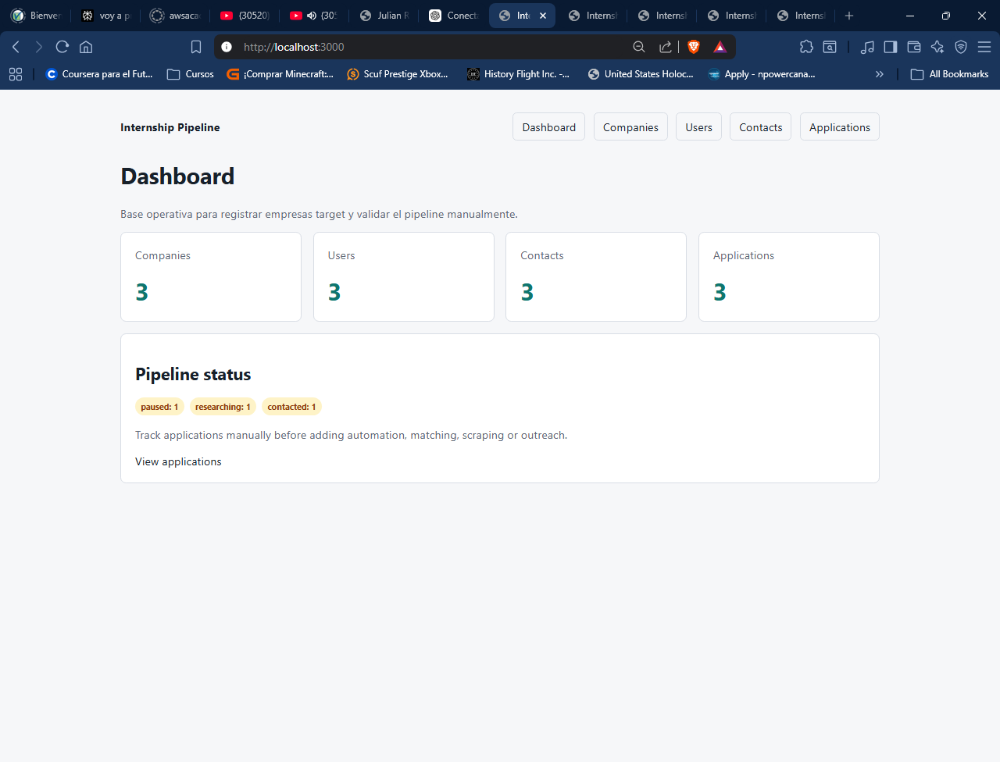
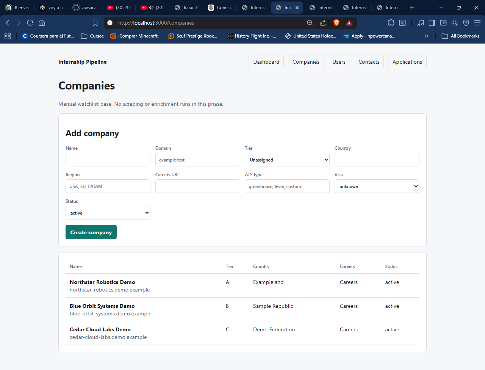
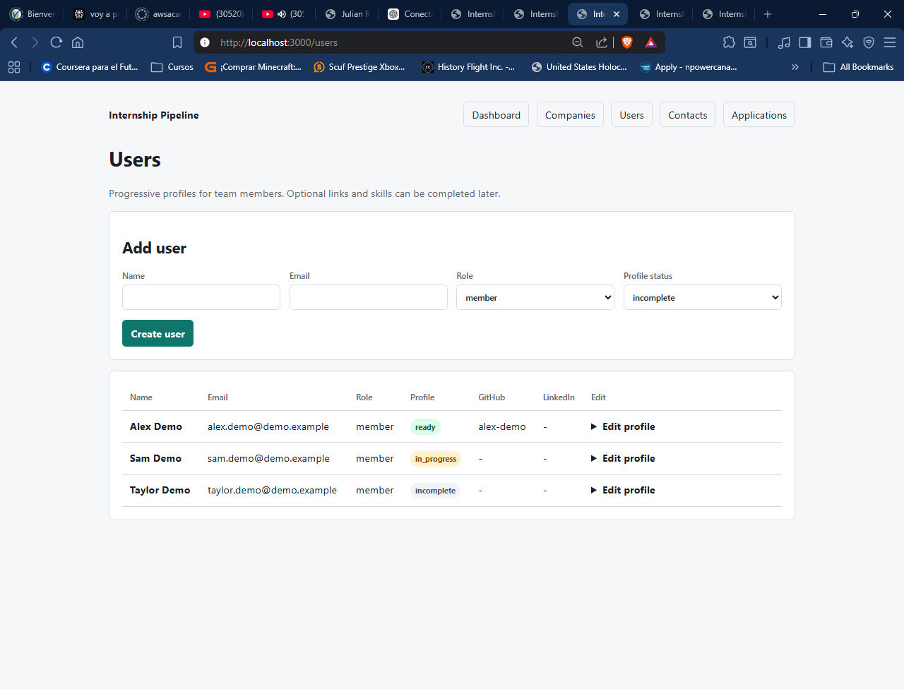
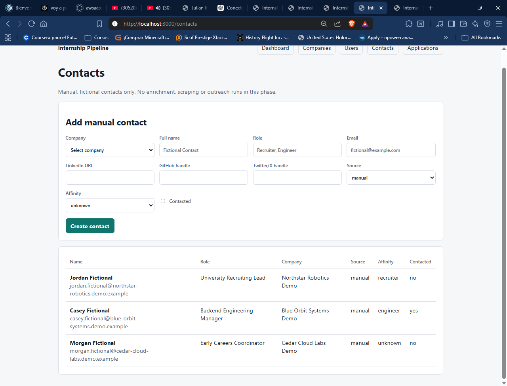
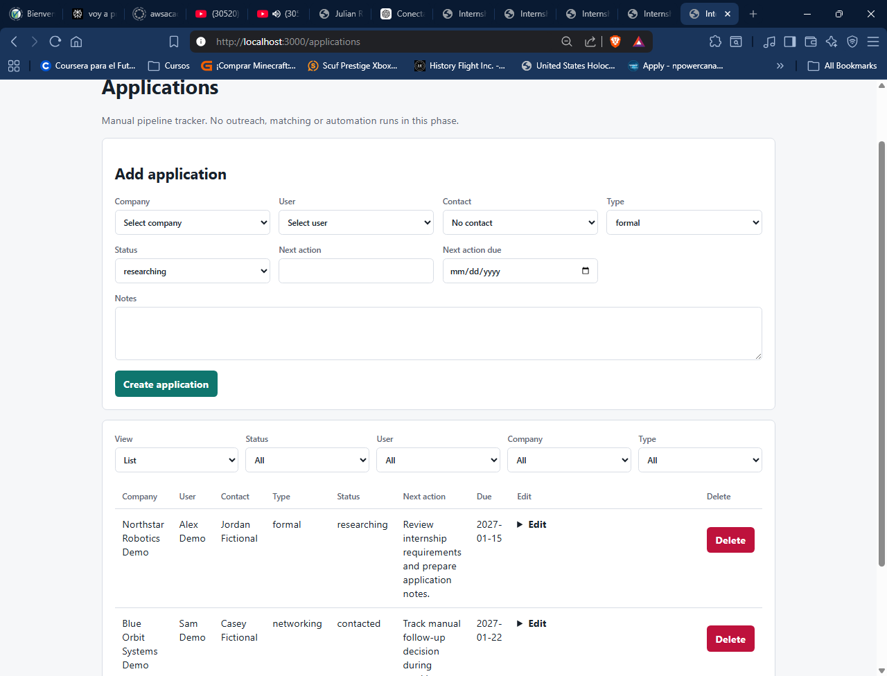

# Internship Pipeline System

Self-hosted platform for organizing an international internship pipeline with companies, team members, contacts, applications, discovery candidates, company ownership, internal reminders and a dashboard.

## Project Status

MVP manual in development.

The current system is intentionally safe and reviewable: it does not scrape websites, send emails, automate outreach, use real personal data, or call external enrichment/LLM APIs. Discovery is demo-only and creates pending candidates that require human approval before becoming companies. Reminders are internal visibility only and do not send notifications.

## Problem

Student teams often apply to internships in a fragmented way:

- company research lives in spreadsheets or chats
- team members duplicate effort without visibility
- contacts and next actions are easy to lose
- application statuses are hard to compare
- automation is risky without a clean source of truth

## Solution

Internship Pipeline System centralizes the manual workflow before automation:

- target companies
- progressive team profiles
- manual contacts
- applications linked to companies, users and contacts
- discovery candidates held in a pending-review layer
- manual company claiming for team coordination
- internal reminders for overdue and upcoming manual actions
- status board and list views
- dashboard summary for pipeline visibility

This creates a structured base for future discovery, reminders, matching and assisted outreach while keeping human review in the loop.

## Current Features

- Companies CRUD
- Users CRUD with progressive profiles
- Manual contacts CRUD
- Applications tracker
- Applications list and board views by status
- Demo-only company discovery candidates
- Human approval and rejection for discovery candidates
- Demo job postings linked to approved companies when possible
- Company claiming and release for manual team coordination
- Ownership status tracking: unclaimed, claimed, paused and done
- Internal reminders for overdue applications, upcoming actions, pending discovery review and stale company claims
- Company and user detail pages with related records
- Client-side search for companies, users and contacts
- Manual editing of application status, next action, due date and notes
- Controlled application deletion with confirmation
- Filters by status, user, company and type
- Company ownership filters and dashboard ownership counts
- Dashboard reminder counts
- Dashboard summary
- Backend tests with pytest
- Alembic migrations
- Docker Compose local environment
- n8n container available as a future complementary orchestrator

## Tech Stack

- FastAPI
- SQLAlchemy 2.0
- Alembic
- PostgreSQL
- Redis
- Next.js
- Docker Compose
- n8n
- Pytest

## Architecture

```text
Browser
  |
  v
Next.js Frontend
  |
  v
FastAPI Backend
  |
  +--> PostgreSQL
  |
  +--> Redis

n8n runs in Docker Compose as a future complementary orchestrator
for schedules, notifications and webhooks. Core product logic stays
in FastAPI, PostgreSQL and the frontend.
```

## Screenshots

Screenshots below show the current manual MVP. Local screenshot assets are stored under `docs/assets/screenshots/`.

### Dashboard



### Companies



### Users



### Contacts



### Applications Board



## Local Setup on Windows PowerShell

Prerequisites:

- Docker Desktop
- Docker Compose v2

Commands:

```powershell
Copy-Item .env.example .env
docker compose up --build
docker compose exec backend alembic upgrade head
docker compose exec backend pytest
docker compose run --rm --no-deps frontend npm run validate:build
```

## Demo Data

The repository includes a local demo seed script with fictional data only. It creates sample companies, users, contacts and applications using clearly fake `demo.example` domains. The records are intended for local demos and screenshots, not for production use.

Load demo data after applying migrations:

```powershell
docker compose exec backend sh -c "PYTHONPATH=/app python scripts/seed_demo_data.py"
```

Local URLs:

- Frontend: http://localhost:3000
- Backend: http://localhost:8000
- Swagger: http://localhost:8000/docs
- n8n: http://localhost:5678

## Discovery MVP

The `/discovery` page runs a deterministic demo discovery process. It creates fictional `DiscoveryCandidate` records and optional demo `JobPosting` records using `.demo.example` URLs only.

Candidates start as `pending_review`. Approving a candidate creates or links a company by domain or normalized company name, marks the candidate as `approved`, and links the detected job posting to the company when possible. Rejecting a candidate marks it as `rejected`. No real ATS scraping or external discovery is implemented yet.

## Company Claiming

Companies can be manually claimed by a selected user. The ownership fields are `owner_user_id`, `ownership_status`, `claimed_at` and `ownership_notes`. Claiming is a coordination tool only; there is no authentication or permissions layer yet, so the user is selected manually from the existing users list.

Releasing a company clears the owner, resets the status to `unclaimed`, clears `claimed_at` and clears ownership notes. The dashboard shows simple counts for unclaimed, claimed, paused and done companies.

## Internal Reminders

The `/reminders` page computes reminders from existing records without creating a reminders table. It shows overdue application actions, actions due today, actions due soon, pending discovery candidates and stale claimed companies.

This is internal visibility only. It does not send emails, create outreach, call external APIs or run n8n workflows. Future notification workflows can build on this layer after review.

## n8n Internal Reminders Demo

The repository includes a local demo n8n workflow export at `n8n/workflows/internal-reminders-demo.json`. It manually calls `http://backend:8000/reminders/n8n-summary` from inside the Docker network and formats a reminder summary inside n8n.

The workflow is inactive, local/demo-only and contains no credentials. It does not send emails, outreach, Slack, Discord or external webhooks.

Local-dev limitation: the reminders summary endpoint does not require authentication yet. Keep the workflow local/internal until auth and an approved internal notification channel are added.

## API Overview

- `GET /health`
- `/companies`
- `/companies/{id}`
- `POST /companies/{id}/claim`
- `POST /companies/{id}/release`
- `PATCH /companies/{id}/ownership`
- `/companies/{id}/contacts`
- `/companies/{id}/applications`
- `/users`
- `/users/{id}`
- `/users/{id}/applications`
- `/contacts`
- `/applications`
- `/discovery-candidates`
- `POST /discovery-candidates/run-demo-discovery`
- `POST /discovery-candidates/{id}/approve`
- `POST /discovery-candidates/{id}/reject`
- `/job-postings`
- `GET /reminders`
- `GET /reminders/n8n-summary`
- `GET /dashboard/summary`

Each resource supports the current MVP CRUD workflow through the FastAPI backend. Detailed schemas are available in Swagger at http://localhost:8000/docs after the stack is running.

## Testing

Run backend tests:

```powershell
docker compose exec backend pytest
```

The test suite overrides the FastAPI database dependency and wraps each test in a transaction with rollback. Tests should not leave companies, ownership changes, users, contacts, applications, discovery candidates or job postings visible in the development dashboard.

Run frontend build:

```powershell
docker compose run --rm --no-deps frontend npm run validate:build
```

If the dev server ever shows stale `.next` chunk errors after build validation, restart it with a clean Next.js cache:

```powershell
docker compose stop frontend
docker compose run --rm --no-deps frontend npm run clean
docker compose up -d frontend
```

## Safety, Ethics and Compliance

The MVP currently:

- does not scrape LinkedIn or company websites
- does not use Apollo or Hunter
- does not send emails
- does not automate outreach
- does not use real personal data
- does not call Resend, OpenAI, Anthropic or similar APIs
- does not publish n8n workflows

The project is designed to build a safe source of truth first. Any future automation should require explicit review, compliance checks and human approval.

## Roadmap

### Phase 1

- improve tracker UX
- add detail views by company and user
- expand safe discovery review workflows

### Phase 2

- controlled ATS discovery research with strict allowlists
- internal n8n workflows
- notifications for next actions
- manual reminders

### Phase 3

- assisted technical matching
- controlled enrichment
- LLM draft generation with human review

### Phase 4

- broader automated discovery
- People Finder
- compliance review and human approval gates

## Portfolio Angle

This project demonstrates:

- full-stack architecture
- backend API design with FastAPI
- relational data modeling with PostgreSQL
- SQLAlchemy 2.0 ORM usage
- Alembic migrations
- Dockerized local development
- backend test isolation
- frontend dashboard development with Next.js
- product thinking around data workflows and automation safety

## Repository Notes

Use `.env.example` as the template for local configuration. Do not commit `.env`, real credentials, API keys, tokens or private data.
